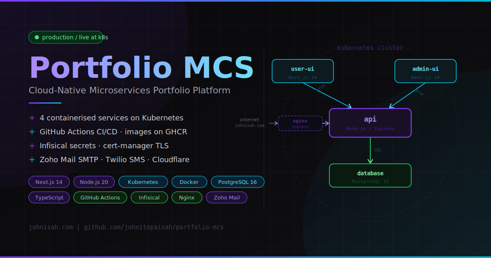

# Portfolio MCS

A production-grade, microservices-based portfolio platform built with Next.js, Node.js, and PostgreSQL. Features a public portfolio website, a private admin CMS, an AI-powered job intelligence system, an application CRM, automated CV generation, and a full observability stack — all deployed on Kubernetes via ArgoCD GitOps.

| Service | URL |
|---|---|
| Public portfolio | https://johnisah.com |
| Admin dashboard | https://admin.johnisah.com |
| REST API | https://api.johnisah.com |
| API docs (Swagger) | https://api.johnisah.com/api/docs |
| Grafana | https://grafana.johnisah.com |

---

## Architecture

```
┌─────────────────────────────────────────────────────────────────┐
│  Kubernetes cluster (portfolio namespace)                        │
│                                                                  │
│  ┌──────────────┐  ┌──────────────┐  ┌──────────────────────┐  │
│  │  user-ui     │  │  admin-ui    │  │  api                 │  │
│  │  Next.js 14  │  │  Next.js 14  │  │  Node.js / Express   │  │
│  │  port 3000   │  │  port 3001   │  │  port 4000           │  │
│  └──────┬───────┘  └──────┬───────┘  └──────────┬───────────┘  │
│         │                 │                       │              │
│         └─────────────────┴───────────────────────┘             │
│                                           │                      │
│                              ┌────────────▼────────────┐        │
│                              │  db (PostgreSQL 16)     │        │
│                              │  StatefulSet, 5Gi PVC   │        │
│                              └─────────────────────────┘        │
│                                                                  │
│  CronJobs (jobs namespace area):                                 │
│    job-ingestion (every 15 min)  │  email-worker (hourly)       │
│    follow-up-worker (daily)      │  cv-worker (on-demand)       │
└─────────────────────────────────────────────────────────────────┘

┌─────────────────────────────────────────────────────────────────┐
│  Kubernetes cluster (monitoring namespace)                       │
│                                                                  │
│  Prometheus ─── Grafana (7 dashboards) ─── Alertmanager         │
│  node-exporter ─── kube-state-metrics ─── postgres-exporter     │
└─────────────────────────────────────────────────────────────────┘

Secrets: Infisical operator → K8s Secrets (no plaintext in git)
GitOps:  ArgoCD App-of-Apps → watches main branch → auto-syncs
CI/CD:   GitHub Actions → GHCR (ghcr.io/johnitopaisah/portfolio-mcs/*)
```

---

## Services

| Service | Technology | Port | Description |
|---|---|---|---|
| `user-ui` | Next.js 14 + TypeScript + Tailwind | 3000 | Public portfolio — SSR, SEO optimised |
| `admin-ui` | Next.js 14 + TypeScript + Tailwind | 3001 | Private CMS — full content management |
| `api` | Node.js 20 + Express | 4000 | REST API, JWT auth, all business logic |
| `db` | PostgreSQL 16 | 5432 | Primary datastore (internal only) |

---

## Feature overview

### Public portfolio (`user-ui`)

- Hero, Projects, Skills, Experience, Certifications, Contact sections
- AI-curated Jobs page (scored by Claude Haiku)
- Server-side rendered with Next.js revalidation
- Dynamic OpenGraph image generation

### Admin CMS (`admin-ui`)

- Full CRUD for all portfolio sections (profile, projects, skills, experience, certifications)
- File uploads: avatar, resume (EN + FR), project images, skill icons
- Contact message inbox
- Job intelligence browser + relevance feedback
- Application CRM (applied → interview → offer / rejected)
- CV Library — download AI-tailored PDFs in English or French
- Gmail inbox sync with application status classification
- AI Engine configuration panel (keywords, scoring weights)

### REST API (`api`)

- JWT authentication with bcrypt
- Portfolio CRUD routes with file upload (Multer)
- Swagger UI at `/api/docs`
- Prometheus metrics at `/metrics`
- Job ingestion workers (Jooble, RemoteOK, Adzuna)
- AI scoring via Claude Haiku (`@anthropic-ai/sdk`)
- CV generation via Puppeteer (HTML → PDF)
- Gmail OAuth email tracking
- GeoIP visitor analytics
- Daily digest emails (08:00 Paris time)

### Monitoring

- **Prometheus** — 30-day time-series retention
- **Grafana** — 7 dashboards: System Overview, API Performance, Database Health, Infrastructure, Business Metrics, Alerts & SLO, Visitor Analytics
- **Alertmanager** — email alerts via Zoho SMTP
- **Exporters** — node-exporter, kube-state-metrics, postgres-exporter

---

## Database schema (key tables)

| Table | Description |
|---|---|
| `profile` | Owner profile — name, bio, avatar, resume, social links |
| `projects` | Portfolio projects with tech stacks, images, publish state |
| `project_images` | Multi-image gallery per project |
| `skills` | Skills with category and 1–5 proficiency |
| `experiences` | Work history with date ranges and tech stacks |
| `certifications` | Credentials with issuer and credential links |
| `contact_messages` | Contact form submissions |
| `admin_user` | Single admin account (bcrypt hash) |
| `job_listings` | AI-scored jobs from 3 providers |
| `job_feedback` | Per-job thumbs up/down (improves scoring) |
| `ai_pattern_config` | Configurable AI scoring keywords and weights |
| `applications` | Job application CRM (status tracking) |
| `application_emails` | Gmail threads linked to applications |
| `visitor_logs` | Anonymised visitor analytics |
| `notification_log` | Digest dedup tracking |

Full schema in [db/schema.sql](db/schema.sql) — migrations in [db/migrations/](db/migrations/).

---

## Quick start (local development)

### Prerequisites

- Docker & Docker Compose
- Node.js 20+ (optional, for running services without Docker)
- Make

### Setup

```bash
git clone <repository-url>
cd portfolio-mcs

# Create .env from template
make setup

# Generate bcrypt hash for your admin password
make hash-password
# Copy the resulting $2b$12$... hash into ADMIN_PASSWORD_HASH in .env

# Fill in JWT_SECRET (required):
node -e "console.log(require('crypto').randomBytes(64).toString('hex'))"
# Paste the output into JWT_SECRET in .env

# Start all 4 services
make up
```

### Access

| Service | URL |
|---|---|
| Public portfolio | http://localhost:3000 |
| Admin dashboard | http://localhost:3001 |
| API | http://localhost:4000 |
| Swagger docs | http://localhost:4000/api/docs |
| Database | localhost:5432 |

### First login

Navigate to http://localhost:3001 and log in with username `admin` and the password you hashed above.

---

## Project structure

```
portfolio-mcs/
├── docker-compose.yml          Local development orchestration
├── Makefile                    Convenience shortcuts (see below)
├── .env.example                Environment variable template
├── architecture-diagram.svg
│
├── api/                        REST API (Node.js/Express) → api/README.md
├── user-ui/                    Public portfolio (Next.js) → user-ui/README.md
├── admin-ui/                   Admin CMS (Next.js) → admin-ui/README.md
├── db/                         PostgreSQL setup + migrations → db/README.md
├── scripts/                    Utility scripts → scripts/README.md
│
├── k8s/                        Kubernetes manifests → k8s/README.md
│   ├── argocd/                 ArgoCD Application CRDs (App-of-Apps)
│   ├── infisical/              Secret sync CRDs
│   ├── db/ api/ user-ui/ admin-ui/ jobs/ policies/ backup/
│   └── deploy.sh
│
├── monitoring/                 Observability stack → monitoring/README.md
│   ├── prometheus/
│   ├── grafana/dashboards/     7 pre-built dashboard ConfigMaps
│   ├── alertmanager/
│   ├── exporters/
│   └── argocd/
│
└── .github/workflows/          CI/CD pipelines
    ├── api.yml                 Build + push api image on tag
    ├── user-ui.yml             Build + push user-ui image on tag
    ├── admin-ui.yml            Build + push admin-ui image on tag
    ├── db.yml                  Build + push db image on tag
    ├── all-services.yml        Build all images together
    └── build-and-deploy.yml    Matrix build on push/PR
```

---

## Makefile commands

```bash
# First-time setup
make setup              # Create .env from .env.example
make hash-password      # Generate bcrypt hash for admin password

# Development lifecycle
make up                 # Build and start all 4 services
make down               # Stop all services
make restart            # Stop then start
make rebuild            # Force rebuild all images

# Rebuild individual services
make rebuild-api
make rebuild-user
make rebuild-admin
make rebuild-db

# Partial stack
make up-db              # Database only
make up-api             # Database + API
make up-user            # Database + API + user-ui
make up-admin           # Database + API + admin-ui

# Observability
make logs               # Tail all service logs
make status             # Container status

# Cleanup
make clean              # Remove all containers, volumes, and images
```

---

## CI/CD

GitHub Actions builds and pushes Docker images to GitHub Container Registry (GHCR) on every push to `main` or `develop`, and on version tags.

### Image tags

| Event | Tag pattern |
|---|---|
| Push to `main` | `latest` |
| Push to `develop` | `develop` |
| Tag `v1.2.3` | `1.2.3`, `1.2` |
| Any push | `sha-<commit>` |

### Image registry

```
ghcr.io/johnitopaisah/portfolio-mcs/api:TAG
ghcr.io/johnitopaisah/portfolio-mcs/user-ui:TAG
ghcr.io/johnitopaisah/portfolio-mcs/admin-ui:TAG
ghcr.io/johnitopaisah/portfolio-mcs/db:TAG
```

ArgoCD watches the `main` branch and auto-syncs the cluster when manifests in `k8s/` change.

---

## API reference (summary)

### Public endpoints

```
GET  /api/health
GET  /api/profile
GET  /api/projects
GET  /api/skills
GET  /api/experiences
GET  /api/certifications
POST /api/contact
GET  /api/jobs
GET  /api/docs              Swagger UI
GET  /metrics               Prometheus scrape endpoint
```

### Admin endpoints (JWT required — `Authorization: Bearer <token>`)

```
POST /api/auth/login
POST /api/auth/forgot-password
POST /api/auth/reset-password

GET|PUT          /api/profile
GET|POST|PUT|DELETE  /api/projects
GET|POST|DELETE  /api/projects/:id/images
GET|POST|PUT|DELETE  /api/skills
GET|POST|PUT|DELETE  /api/experiences
GET|POST|PUT|DELETE  /api/certifications
GET|PATCH        /api/contact
GET|POST|PUT|DELETE  /api/applications
GET              /api/admin/jobs
POST             /api/admin/jobs/:id/feedback
GET|PUT          /api/admin/ai
```

---

## Production deployment

See [k8s/README.md](k8s/README.md) for the full guide. Summary:

1. Install ArgoCD and apply the root App-of-Apps: `kubectl apply -f k8s/argocd/root-app.yaml`
2. Bootstrap Infisical machine identity secret in both `portfolio` and `monitoring` namespaces
3. Populate all secrets in Infisical (see `k8s/secrets/01-app-secret.example.yaml`)
4. Create GHCR pull secret in the `portfolio` namespace
5. Push to `main` — ArgoCD auto-syncs everything

---

## Security

- Secrets managed by Infisical operator — zero plaintext in git
- JWT tokens with bcrypt (cost 12) password hashing
- Helmet.js security headers on all API responses
- CORS restricted to configured origins
- Rate limiting on API endpoints
- Network policies restricting pod-to-pod traffic
- Non-root container execution
- HTTPS enforced via cert-manager (Let's Encrypt) on all public domains

---

## Author

**John Itopa ISAH**
- Email: johnitopaisah@gmail.com
- GitHub: [@johnitopaisah](https://github.com/johnitopaisah)
- LinkedIn: [johnitopaisah](https://linkedin.com/in/johnitopaisah)

---

Built with Next.js, Node.js, PostgreSQL, and Kubernetes.
