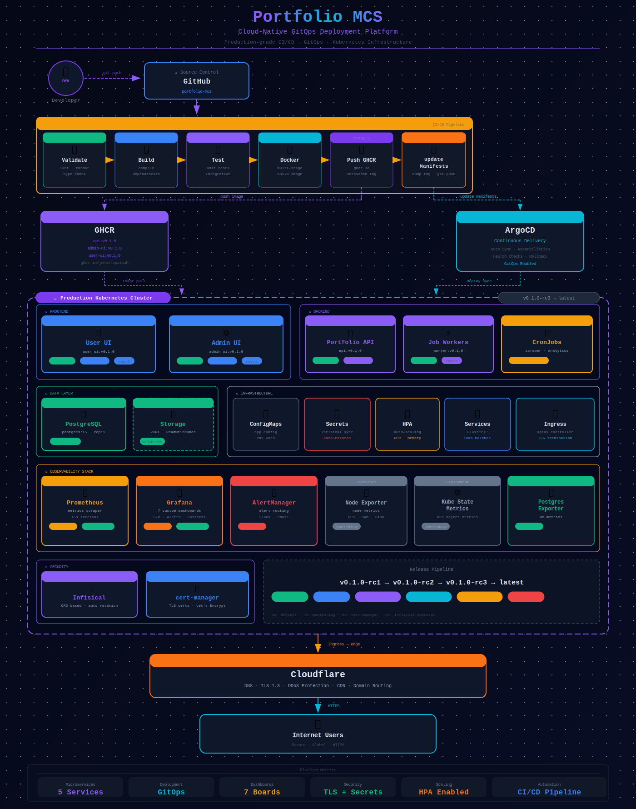

# Kubernetes Manifests

Production-grade Kubernetes manifests for all Portfolio MCS workloads, managed via **ArgoCD GitOps**. Targets a 3-node Minikube cluster (dev) or any cloud K8s cluster (prod).

---

## Namespaces

| Namespace | Purpose |
|---|---|
| `portfolio` | All application workloads (api, user-ui, admin-ui, db, jobs) |
| `monitoring` | Prometheus, Grafana, Alertmanager, exporters |
| `backup` | Backup CronJobs and RBAC |

---

## Directory structure

```
k8s/
├── 00-namespace.yaml               portfolio namespace
├── 01-configmap.yaml               Non-sensitive config (API URLs, CORS origins)
├── 02-policies.yaml                Umbrella policy manifest
├── 03-advanced.yaml                Advanced scheduling config
│
├── argocd/                         ArgoCD Application CRDs (GitOps control plane)
│   ├── project.yaml                ArgoCD project scoped to the portfolio namespace
│   ├── root-app.yaml               App-of-Apps root — manages all child apps
│   ├── app-db.yaml
│   ├── app-api.yaml
│   ├── app-user-ui.yaml
│   ├── app-admin-ui.yaml
│   ├── app-jobs.yaml
│   ├── app-policies.yaml
│   └── app-monitoring-root.yaml    Delegates monitoring stack to monitoring/argocd/
│
├── infisical/                      Secret management (Infisical operator)
│   ├── 01-machine-identity-secret.example.yaml   Template — create this manually
│   └── 02-infisical-secret.yaml                  InfisicalSecret CRD — syncs all app secrets
│
├── secrets/                        gitignored — real secrets never committed
│   ├── 01-app-secret.example.yaml  Key reference template
│   └── 02-ghcr-pull-secret.example.yaml
│
├── db/
│   ├── pvc.yaml                    5Gi PVC for postgres data
│   ├── service.yaml                Headless ClusterIP service
│   └── statefulset.yaml            postgres:16-alpine StatefulSet
│
├── api/
│   ├── serviceaccount.yaml
│   ├── configmap.yaml              Non-secret API config
│   ├── deployment.yaml             2 replicas, pulls from GHCR
│   ├── service.yaml
│   ├── hpa-api.yaml                HPA: min 2, max 6
│   └── ingress-production.yaml     api.johnisah.com, TLS via cert-manager
│
├── user-ui/
│   ├── serviceaccount.yaml
│   ├── configmap.yaml
│   ├── deployment.yaml             2 replicas
│   ├── service.yaml
│   └── hpa-user-ui.yaml            HPA: min 2, max 6
│
├── admin-ui/
│   ├── serviceaccount.yaml
│   ├── configmap.yaml
│   ├── deployment.yaml             1 replica
│   ├── service.yaml
│   └── hpa-admin-ui.yaml           HPA: min 1, max 2
│
├── jobs/                           Automated background workers
│   ├── 01-cronjob-ingestion.yaml   Job ingestion — runs every 15 min
│   ├── 02-configmap-secrets.yaml   Worker config + job API keys
│   ├── 03-cronjob-email.yaml       Gmail sync — hourly
│   └── 04-cronjob-followup.yaml    Application follow-up check — daily
│
├── policies/
│   ├── 01-pdb-api.yaml             PodDisruptionBudget — api (minAvailable: 1)
│   ├── 02-pdb-user-ui.yaml         PodDisruptionBudget — user-ui (minAvailable: 1)
│   ├── 03-pdb-admin-ui.yaml        PodDisruptionBudget — admin-ui
│   ├── 04-network-policy.yaml      Ingress/egress rules (requires Calico CNI)
│   ├── 05-resource-quota.yaml      Namespace resource quota
│   └── 06-limit-range.yaml         Per-container default limits
│
├── backup/                         Database + namespace backup strategy
│   ├── README.md                   Full backup setup guide
│   ├── 00-namespace.yaml
│   ├── 01-rbac.yaml
│   ├── 02-db-backup-configmap.yaml
│   ├── 03-cronjob-db-backup.yaml   Nightly pg_dump to hostPath
│   ├── 04-backup-all-ns.yaml
│   └── 05-cronjob-monitoring-backup.yaml
│
└── deploy.sh                       Bootstrap script (--env local | prod)
```

---

## ArgoCD GitOps

The cluster is managed by ArgoCD using an **App-of-Apps** pattern. Every directory in `k8s/` has a corresponding ArgoCD `Application` CRD in `k8s/argocd/`. ArgoCD watches the `main` branch and automatically syncs any manifests pushed there.

### Bootstrap ArgoCD (one-time)

```bash
# Install ArgoCD
kubectl create namespace argocd
kubectl apply -n argocd -f https://raw.githubusercontent.com/argoproj/argo-cd/stable/manifests/install.yaml

# Apply the root App-of-Apps
kubectl apply -f k8s/argocd/project.yaml
kubectl apply -f k8s/argocd/root-app.yaml

# ArgoCD will discover and sync all child apps automatically
```

### Trigger a manual sync

```bash
argocd app sync portfolio-root
argocd app sync portfolio-api
```

---

## Secrets management (Infisical)

All sensitive values are stored in [Infisical](https://app.infisical.com) and synced into Kubernetes Secrets by the Infisical operator. No plaintext secrets are committed to git.

### One-time setup

```bash
# 1. Install the Infisical operator
kubectl apply -f https://raw.githubusercontent.com/Infisical/infisical/main/k8-operator/config/install/install.yaml

# 2. Create the machine identity secret (credentials from Infisical dashboard)
kubectl create secret generic infisical-machine-identity \
  --namespace portfolio \
  --from-literal=clientId=YOUR_CLIENT_ID \
  --from-literal=clientSecret=YOUR_CLIENT_SECRET

# 3. Apply the InfisicalSecret CRD (syncs all app secrets)
kubectl apply -f k8s/infisical/02-infisical-secret.yaml
```

The operator polls Infisical every 60 seconds and keeps the `portfolio-secrets` K8s Secret in sync automatically.

---

## GHCR pull secret (one-time)

Images are published to GitHub Container Registry. Create a PAT with `read:packages` scope:

```bash
kubectl create secret docker-registry ghcr-pull-secret \
  --namespace portfolio \
  --docker-server=ghcr.io \
  --docker-username=johnitopaisah \
  --docker-password=YOUR_GITHUB_PAT \
  --docker-email=johnitopaisah@gmail.com
```

---

## First deploy

```bash
chmod +x k8s/deploy.sh

# Local (Minikube)
./k8s/deploy.sh --env local

# Production
./k8s/deploy.sh --env prod
```

Or let ArgoCD handle it after bootstrapping the root app.

---

## Useful commands

```bash
# All pods in the portfolio namespace
kubectl get pods -n portfolio

# Tail API logs
kubectl logs -n portfolio -l component=api -f

# Check Infisical sync
kubectl describe infisicalsecret portfolio-infisical-secret -n portfolio

# Open a psql shell
kubectl exec -it -n portfolio statefulset/portfolio-db -- \
  psql -U portfolio_user -d portfolio_db

# Rolling restart to pull a new image
kubectl rollout restart deployment/portfolio-api -n portfolio

# HPA status
kubectl get hpa -n portfolio
```

---

## Minikube quick start

```bash
minikube start --cpus=4 --memory=6144
minikube addons enable ingress
minikube addons enable metrics-server

# Add local DNS
echo "$(minikube ip) johnisah.local api.johnisah.local admin.johnisah.local grafana.johnisah.local" \
  | sudo tee -a /etc/hosts
```

For NetworkPolicy enforcement on Minikube:

```bash
minikube delete && minikube start --cni=calico --cpus=4 --memory=6144
```
